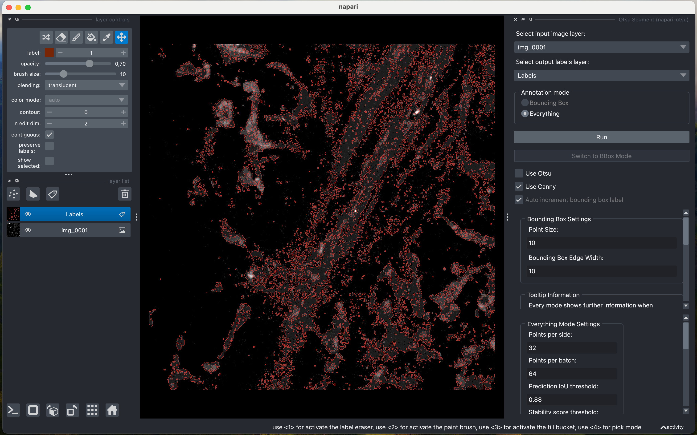

# napari-otsu

## Canny Edge Detection

### Overview

Canny Edge Detection is a popular edge detection algorithm used to identify edges within an image. It works by:
1. Smoothing the image with a Gaussian filter to reduce noise.
2. Calculating the gradient intensity and direction to detect edges.
3. Applying non-maximum suppression to thin the edges.

### Example

Here is an example of an image before and after applying Canny Edge Detection:

#### Original Image

#### After Canny Edge Detection

